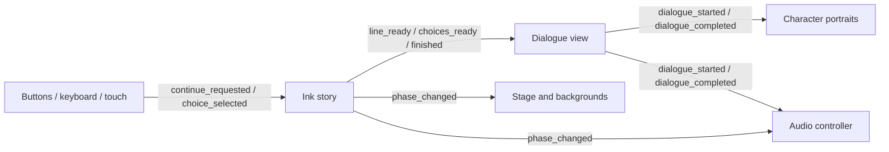

# Unity → Godot migration

Baseline: Unity 6000.0.30f1 at commit
`6bf2c52f0455cca9615d2650001fb80f178b4096`. Godot target: 4.7, tested on 4.7.2.

`Persistent.unity` contains the actual visual novel. Its behavior lives in
`scenes/main.tscn`, `scenes/dialogue_choices.tscn`, and six GDScript files.
`Storm.unity` contains only a camera,
light, and default scene settings; it has no additional gameplay to port.

## Events become signals

All fixed connections below are serialized as `[connection ...]` entries in
`scenes/main.tscn`. Select a node's **Signals** panel in Godot to inspect them.
Dynamic choice rows connect their press, focus, and hover signals in code.
No UnityEvent adapter, polling event bus, or C# runtime remains in the game.

| Unity event / callback | Godot signal and subscribers |
| --- | --- |
| `UIInteractionBus._actionOnInteraction → InvokeContinue` | Button `pressed` / mouse, touch, keyboard input → view `advance()` → `continue_requested` → `Story.advance()` |
| `DialoguePlayer._dialogueEvent → UpdateDialogue` | `Story.line_ready(text, tags)` → view `_show_line()` |
| `TagTransposer._characterNameEvent`, `_noCharacterNameEvent` | `line_ready` tags → speaker label, blank for untagged narration |
| `_playerCharacterSpriteEvent`, `_nonPlayerCharacterSpriteEvent → ChangeSpriteSet` | `dialogue_started(character, emotion)` → both portraits; the matching character begins fading to the authored highlighted sprite |
| Sprite event `→ GreyOut` | `dialogue_started` fades the listener to a dimmed, unlit frame of their last emotion |
| Sprite event `→ PlaySound` | `dialogue_started` → `Audio.on_dialogue_started()` → character typing loop |
| `UniTaskCompletionSource`, `_playerDialogueEndEvent`, `_npcDialogueEndEvent → Highlight` | `dialogue_completed(character, emotion)` → both portraits fade to unhighlighted poses; highlight timing is intentionally reversed from the Unity implementation |
| Dialogue-end events `→ StopSound` | `dialogue_completed` → `Audio.on_dialogue_completed()` |
| `_revealChoicesEvent → ShowChoices` | `Story.choices_ready(choices)` → terminal menu with dynamic numbered rows |
| `MakeChoice`, `_makeChoiceEvent → HideChoices` | Row press or keyboard confirmation → menu `selected(index)` → `choice_selected(index)` → `Story.choose(index)` |
| `_onStormInitiated`, `_onStormEnded → SwapCamera / ZoomOut / ZoomIn` | `Story.phase_changed(phase)` → view stage tween; camera projection and UI endpoints use the original values |
| `BackgroundChanger._changeBackgroundEvent → ChangeSpriteSet` | `phase_changed` → each background's `play(phase)` |
| `_musicPlayEvent → PlayMusic` | `phase_changed` → `Audio.on_phase_changed()` → act selection and crossfade |
| Start / replay | `restart_requested` → reset audio and portraits, then initialize the story; `continue_requested` requests its first line |
| Story end | `Story.finished` → replay UI and stop typing audio |
| Audio toggle | Button `toggled` → `sound_toggled(muted)` → `Audio.set_muted()` |

`_gameStartEvent` had an empty serialized callback, and `KeyboardInteractionBus`
had no implementation. The Godot scene has explicit startup and keyboard input.

## Preserved behavior and deliberate fixes

- The first migration retained the original compiled story. The 50 commented
  opening lines have since been restored at the user's request, preserving their
  text and tags, and recompiled with official inklecate 1.2.1 (Ink JSON 21).
  Later authoring replaces the linear argument with the new conflict below.
  Full Ink semantics remain available through the vendored runtime.
- `Opening.ink` now supplies the authored Yuvan choices and Aneska's responses.
  There are 63 opening routes, returning either at the binary-star joke or at
  "I just really miss you" before the original cuddle/movie sequence. The later
  joins resume previously raised topics and remember Aneska's tiredness
  disclosure, avoiding repeated introductions and explanations.
- `Conflict.ink` adds six scored choices after the binary-star conversation.
  Four decisions build the conflict before the original storm visuals begin;
  two decisions and the central disclosure play during the storm. The final
  empathy total selects one of three resolutions, whose opening exchange then
  triggers the original background and music recovery. `BRANCH2` and `OUTRO`
  retain the old alternate dialogue as reference knots, outside the active story.
- SpriteFrames resolve Unity GUIDs directly, preserving emotional frame sets,
  resting/glow sprites, the 250 ms cadence, and 17-frame forward/reverse storms.
  Speaker focus follows the time while a line is being revealed: the speaker uses
  the authored highlighted sprite (named `*_idle` in the imported resources)
  with a 0.15-second fade in; the listener uses a dimmed, unlit frame of their last
  emotion. Both portraits fade to unhighlighted over 0.25 seconds after typing
  finishes, including click-to-reveal, and during narration. A portrait-only shader
  blends the original textures, including their transparency; backgrounds retain
  their frame playback. Each portrait has independent, adjustable fade durations.
  Rapid input reverses from the current blend, and restart clears pending fades.
  The highlighted portrait is a still image; the imported
  portrait animation frames remain available as source assets.
  Storm backgrounds hold their final frame. After the reverse animation,
  `star_background.gd` crossfades over one second to the original calm texture.
  The storm canvases have different padding and Yuvan's calm art has a different
  orientation; holding storm frame 1 left the ending visibly misaligned. New
  phase signals cancel that recovery fade. Media files are reused without recompression.
  The separate eight-frame `Breakdown/3_Storm_*` assets were not referenced by the
  Unity background databases and remain unused; the connected starburst sequence
  uses `2_Storm_*` frames, followed by their reverse on recovery.
- Text reveals every 65 ms. A click during typing now reveals the line; the next
  click advances. Completion emits a signal instead of resolving a UniTask.
  The speaker name is measured and placed below the full dialogue, keeping its
  position stable during typing and after wrapped paragraphs. On advance, the
  actual RichTextLabel moves into the history layer without changing its screen
  position, size, wrapping, or brightness. A one-second departure moves and fades
  it into the trail before the next line begins typing and emits its speaking
  signal. Another click completes that handoff and reveals the next line.
  Whole paragraphs stay upright, shrink uniformly, drift upward, and fade over
  24 seconds, with a gentle ease-in that keeps recent lines readable longer.
  Up to five entries can recede together, with spacing for wrapped text and rapid
  input. Faded labels are freed, and restart clears the entire trail. The current
  dialogue remains in place until the player advances; narration has no name.
- The camera's 40-degree field of view and z=-13/-29 positions are translated
  into equivalent 2D starfield sizes. Portrait/background endpoints and the
  ten-second transition duration come from the original USS/Cinemachine settings.
- Music fades to the original 0.195 linear volume. Cancellable Godot tweens
  replace float-equality async loops, preventing runaway fades on rapid events.
  Completed fades stop inaudible tracks. All three acts loop.
- Unity's Yuvan SAD sprite was null. Godot falls back to his neutral pose; this
  emotion is not used for Yuvan in the checked-in story.
- Choices no longer assume exactly three entries. A navy terminal panel uses
  JetBrains Mono, a lavender cursor and selection bar, and muted inactive rows.
  Arrow keys/Tab wrap through responses; number keys 1–9 select, Enter/Space
  confirm, and clicks/taps choose directly. Confirmation consumes the input so it
  cannot also reveal the next dialogue line. Long responses wrap beneath their
  text column; larger menus scroll within a bounded panel. Restart clears focus
  and rows. Invalid Ink choice indices are ignored. The choice preview shortcut
  now opens the first menu of the same main story; tests retain an isolated
  opening fixture. The novel's old dormant route selector remains unchanged.
  The bundled font's OFL license is included in every export preset.
- The existing `conversation_speed` variable and 1000-second threshold remain.
  The old speed-based route selector is inactive. New narrative decisions use
  the empathy system instead; the legacy time threshold is unchanged.
- The new `aneska_empathy` Ink variable starts at 0 (neutral). `Empathy.ink`
  implements the approved nine-cell tone matrix. Each scored choice branch calls
  `ScoreEmpathy(prompt_tone, response_tone)` once, and later dialogue can test the
  accumulated value after paths rejoin or at the final resolution.
  `Story.aneska_empathy` reads that same state; `empathy_changed(value)` reports
  changes to Godot. Restart resets it and removes the previous story's observer.
  The main game scores nine or ten choices per route, preserving the total
  through every join and the ending. Prompt tones used for this playable pass
  are documented in the story workshop. There is no meter. The resolution
  thresholds are 5+ for closeness, 0–4 for partial repair, and below 0 for distance.
  `final_empathy` stores the tally; `Story.ending_title` supplies the final caption.
  The thresholds and new dialogue are initial playtest values.
- `ending_reveal.tscn` presents a centered **Ending Unlocked** label and a 64px
  title over a soft lavender spotlight. The last line and its speaker fade out
  as the reveal fades in. Replay receives keyboard focus after the reveal;
  restart cancels the animation and restores dialogue opacity. All three titles
  and the small-window layout are covered by rendered checks.
- Small speaker labels, replay, audio toggle, keyboard/touch input, and a scalable
  16:9 window make the migrated scene usable independently of Unity's editor.

## Files retained for reference

`Packages/`, `ProjectSettings/`, `Assets/Scenes/`, `Assets/Scripts/`, and
`Assets/UI Toolkit/` have `.gdignore` files. They preserve the original Unity
implementation for comparison without being imported by Godot. Unity `.meta`
and `.asset` files beside the original media remain conversion references.
Export presets exclude all Unity-only files, tests, tools, and test artifacts.
Original media and Unity implementation remain preserved. Earlier Ink wording is
available in version history alongside the newly authored playable opening.

Godot `.import` sidecars and script `.uid` files belong in version control;
the generated `.godot/` cache, `builds/`, and `test-results/` do not.

## Verification and limits

The integration runner instantiates the real scene and exercises its serialized
connections. Reference transcripts were extracted from the original `.ink`
source and the authored dialogue, independently of the compiled JSON. All 63
opening routes preserve their authored text and tags, and each continues through
the new conflict. The retained 22-line alternate route also matches exactly.
All 729 conflict-choice sequences are exercised with varied incoming empathy
and remembered tiredness. Tests check the decision order, distinct responses,
score commitment, final tally, resolution boundaries, and single storm/recovery
events. The storm must span two decisions and at least ten spoken lines.
Continuity checks cover a single binary-star introduction, a single explanation
of Aneska's tiredness, a follow-up that acknowledges Yuvan already feels unwell,
and clearing that conversation state on restart.
Choice fixtures additionally exercise one, two, four, and nine options, plus a
twelve-response menu for wrapping, scrolling, and small-window checks.

Rendering snapshots cover calm, long dialogue, storm, restored backgrounds,
the ending, a 960×540 window, both speaker changes during typing, and the midpoint
of each portrait fade direction, the start and midpoint of text departure,
near and distant dialogue history, and a long dialogue with attribution in a
960×540 window. Choice snapshots cover default and keyboard-selected responses,
wrapped text, a scrolled menu in the smaller window, and the live topic-change
and support menus, plus the energy, relationship, storm, and repair decisions.
The three ending reveals and the distant ending at 960×540 are also captured.
The game pack is exported and launched outside the source directory to verify
resource and story packaging.

This is a native recreation, not a pixel-level comparison against a running
Unity build. The repository does not supply a Unity build, and Unity is not
installed in this environment. The retained scenes/USS are the source of layout
and timing values. Audio playback state and fades are tested; listening quality
has not been independently assessed.

Standalone desktop binaries require platform export templates, which are not
installed in this environment. The project and `.pck` are playable with the
installed Godot executable. OS signing and distribution are separate from the migration.

The official 4.7.2 single-threaded Web template is installed and the Web export
has been tested locally inside both same-origin and cross-origin iframes with
no browser console errors. The Pages workflow passes actionlint; headless and
rendered game checks pass. The Pages workflow builds pull requests and deploys
from `main`; see [Web deployment](WEB_DEPLOYMENT.md) for Pages setup and embedding.

## Dependencies and reference

- [InkGD source and license](../addons/inkgd/UPSTREAM.md): runtime-only vendor,
  pinned to a commit; supports this project's recompiled Ink JSON version 21.
- [Godot signals](https://docs.godotengine.org/en/stable/getting_started/step_by_step/signals.html).
- [Godot image importing](https://docs.godotengine.org/en/stable/tutorials/assets_pipeline/importing_images.html).
